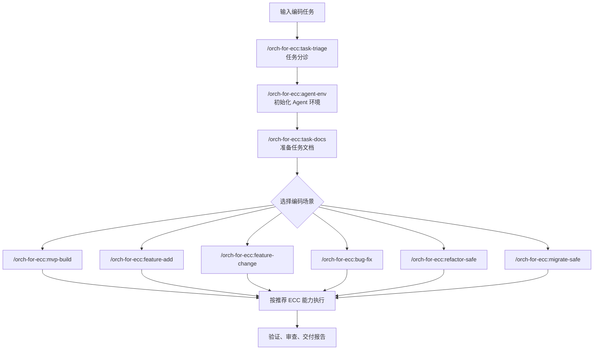

# Orch for ECC

## 介绍

一个基于 Everything Claude Code（ECC）的 Claude Code 编码流程编排插件，用于将编码任务分解为分诊、环境初始化、文档准备、场景执行、验证和交付报告等步骤，使过程更规范、透明、易于审计。

## 依赖说明

本插件依赖 [Everything Claude Code（ECC）插件](https://github.com/affaan-m/ECC/tree/main#step-1-install-the-plugin-recommended)，需要提前安装好。

> 当前仅支持在 Claude Code 中使用；其他 Agent Harness 暂未适配。

## 安装

```bash
# 添加该仓库到插件市场
/plugin marketplace add https://github.com/Light-Alex/orch-for-ecc

# 安装插件
/plugin install orch-for-ecc@orch-for-ecc
```

## 命令条目

| 命令 | 描述 |
| --- | --- |
| `/orch-for-ecc:task-triage` | 分诊任务类型、范围和风险 |
| `/orch-for-ecc:agent-env` | 初始化本次 Agent 协作环境 |
| `/orch-for-ecc:task-docs` | 准备实施计划和交付文档 |
| `/orch-for-ecc:mvp-build` | 从零构建 MVP 或垂直切片 |
| `/orch-for-ecc:feature-add` | 在已有项目中新增功能 |
| `/orch-for-ecc:feature-change` | 按新规格调整已有功能 |
| `/orch-for-ecc:bug-fix` | 定位并修复错误或回归 |
| `/orch-for-ecc:refactor-safe` | 保持行为不变地安全重构 |
| `/orch-for-ecc:migrate-safe` | 分阶段完成代码或架构迁移 |
| `/orch-for-ecc:ecc-check-update` | 检查更新orch-for-ecc插件 |

## 流程说明



## 快速开始

以下是 6 个主要编码场景的 prompt 示例：

```text
/orch-for-ecc:mvp-build
我要从零实现一个最小可用的任务看板，包含任务创建、状态切换和本地持久化。请先确认范围，再给出实施计划并执行。
```

```text
/orch-for-ecc:feature-add
在现有项目中新增导出 CSV 功能，入口放在列表页工具栏。请先寻找相似导出/下载实现，再按现有风格实现并验证。
```

```text
/orch-for-ecc:feature-change
将现有登录失败提示从通用错误改为区分账号不存在、密码错误和账号锁定。请保持接口兼容，并说明风险。
```

```text
/orch-for-ecc:bug-fix
修复用户保存资料后页面仍显示旧昵称的问题。请先定位数据流和缓存更新点，再做最小修复并补充验证。
```

```text
/orch-for-ecc:refactor-safe
在不改变行为的前提下，重构订单金额计算逻辑，减少重复分支。请先建立行为保护，再执行安全重构。
```

```text
/orch-for-ecc:migrate-safe
将项目中的旧版路由 API 迁移到新版路由写法。请先盘点影响范围，分阶段迁移，并保留回滚思路。
```
