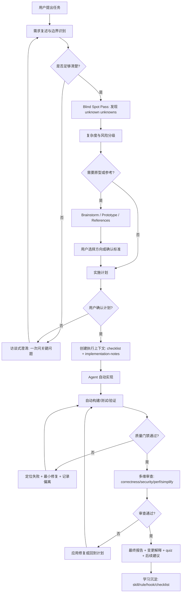
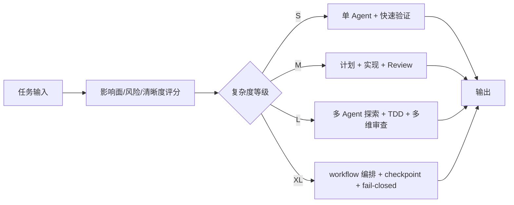
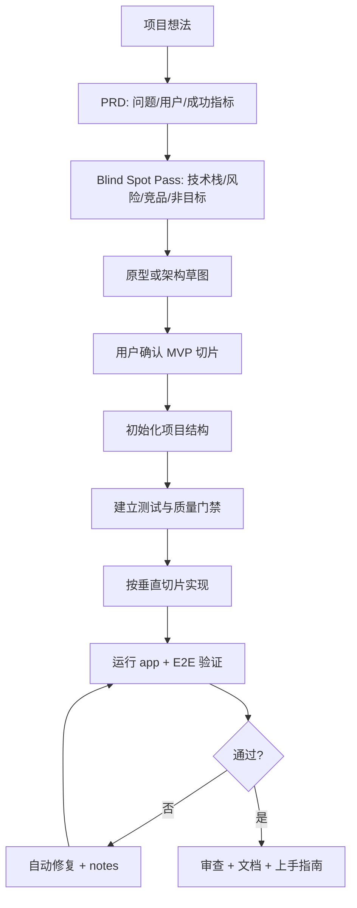
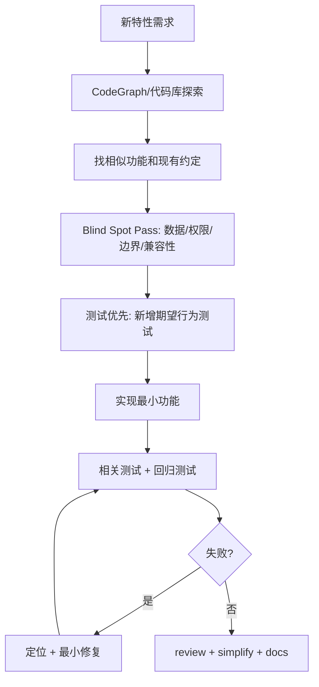
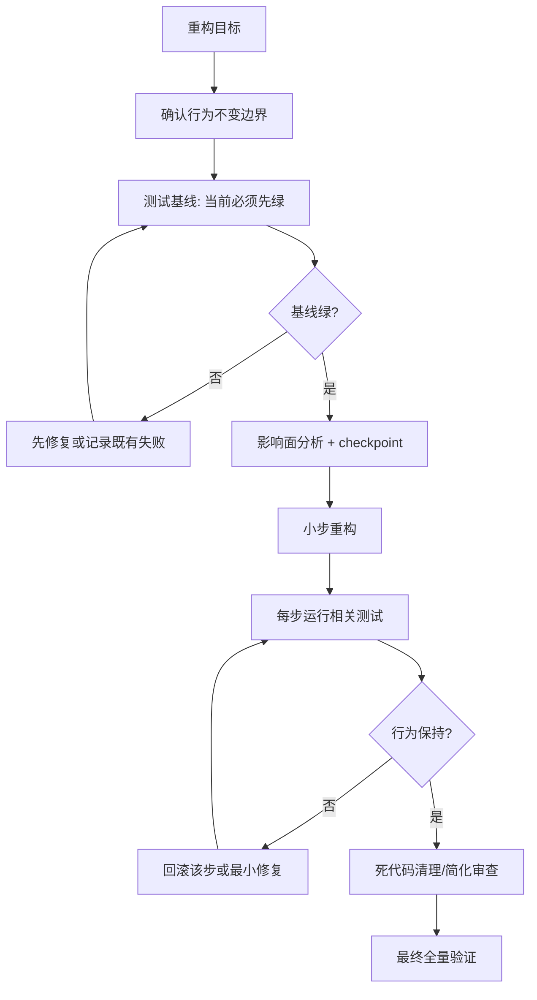
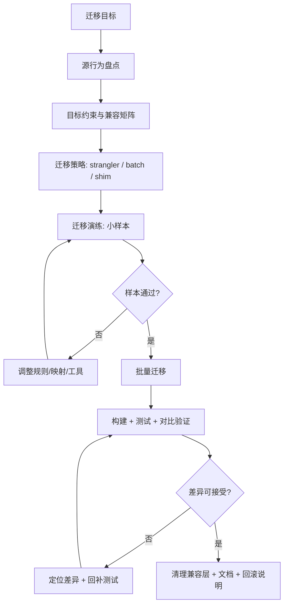
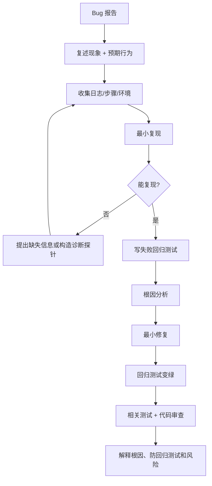

# 基于 ECC 的通用 Agent 自动化工作流方案

> 目标：覆盖从零开发项目、基于已有项目开发新特性、项目重构、代码迁移、定位 + 修复 BUG 五类场景。除前期需求确认与高风险边界确认外，后续尽可能交给 Agent 自动执行；同时用 ECC 的 agents、skills、commands、hooks、rules、workflows 形成可复用、可自适应、可验证的高质量闭环。
>
> ECC版本：v2.0.0

## 1. 核心思想：先减少未知，再放大自治

长任务质量的瓶颈，不只是模型能力，而是“未知”是否被充分发现、记录和处理。

这里把未知分成四类，并映射到工作流动作：

| 未知类型 | 含义 | 工作流动作 | ECC 可用能力 |
| --- | --- | --- | --- |
| Known Knowns | 用户已经明确说出的目标、约束、验收标准 | 需求复述、边界确认、PRD/计划 | `/plan`, `/plan-prd`, `/prp-prd`, planner/architect agents |
| Known Unknowns | 用户知道还没想清楚的点 | 访谈式澄清、方案对比、原型 | `/plan`, `/gan-design`, code-architect/spec-miner agents |
| Unknown Knowns | 用户“看到才知道对不对”的偏好和隐性标准 | 低成本原型、多方案 brainstorm、参考实现对齐 | `/gan-design`, references, plan canvas |
| Unknown Unknowns | 用户没意识到但会影响成败的风险 | blind spot pass、代码库探索、外部资料核验、风险清单 | CodeGraph, code-explorer, docs-lookup, security/performance reviewers |

因此，不建议一上来就让 Agent 写代码。最佳顺序是：

1. **Discover**：发现未知。
2. **Decide**：把关键未知变成明确决策。
3. **Delegate**：边界清楚后交给 Agent 自动执行。
4. **Document**：执行中记录偏离和决策。
5. **Verify**：用测试、真实运行、审查和解释报告收敛质量。
6. **Learn**：把可复用模式沉淀为 ECC skill/rule/hook/workflow。

## 2. 全局自动化边界

用户确认的目标是“全自动流水线”。这里的推荐边界是：

### Agent 可以自动做的事

- 读取需求、代码、文档、issue、测试、日志。
- 做 blind spot pass，提出澄清问题。
- 在用户确认目标、约束、验收标准后，自主制定计划。
- 创建任务清单、分派子 Agent、并行探索和审查。
- 编写代码、测试、文档、迁移脚本、实现 notes。
- 自动运行构建、测试、lint、coverage、E2E、验证命令。
- 遇到失败时自动定位、修复、重跑，直到达到停止条件。
- 自动发起代码审查、安全审查、简化审查、回归测试补强。
- 输出最终解释报告、变更摘要、风险残留、quiz、后续建议。

### Agent 必须暂停确认的事

- 需求目标、业务边界、不可做事项不清楚。
- 需要删除或覆盖用户未明确允许的数据。
- 需要执行生产部署、外部发布、真实支付、真实邮件/短信、批量外部请求。
- 数据库 destructive migration 或不可逆迁移。
- 安全相关高风险动作、凭证处理、权限扩大。
- 测试长期无法收敛，且继续自动修复可能扩大改动面。

### 自动化停止条件

建议每个工作流都内置以下停止条件：

- 连续 N 轮失败没有新增信息。
- 修改范围超过计划边界。
- 新增高风险文件或外部副作用。
- 质量门禁仍失败，但已达到最大修复轮数。
- 审查 Agent 对同一问题出现冲突结论。
- 需求与现有架构冲突，需要用户做产品或架构取舍。

## 3. ECC 能力映射

ECC 的用法不要理解成“全都打开”。更实用的方式是：按项目和任务，把正确组件放到正确位置。

| 需要解决的问题 | ECC 能力 | 实操建议 |
| --- | --- | --- |
| 项目长期规则 | `rules/` | 只复制通用规则 + 当前技术栈规则；不要全量堆叠 |
| 可复用做事方法 | `skills/` | 保留常用技能，让 Claude 按任务触发 |
| 标准入口 | `commands/` | 把高频流程做成 `/plan`、`/build-fix`、`/code-review` 等入口 |
| 专家分工 | `agents/` | 用于只读探索、审查、验证；写文件尽量集中在主 Agent |
| 自动守门 | `hooks/` | 从 `standard` 开始；太吵时按项目调到 `minimal` 或禁用单个 hook |
| 确定性编排 | `workflows/` | 用于 L/XL 任务：并行审查、失败修复循环、迁移验证闭环 |
| 代码理解 | CodeGraph | 修改前先看符号、调用链、影响面，少靠猜 |
| 外部系统 | MCP | 按项目启用；不用的 MCP 通过 `/mcp` 关闭 |

> 实用规则：ECC 的价值不是把所有组件塞进上下文，而是让 Claude 在需要时拿到正确工具。默认少装，按任务加。

这套工作流可以先作为文档模板使用；实践稳定后，再沉淀成 `agentic-delivery-pipeline` skill，并按五类场景拆成 `/orch-build-mvp`、`/orch-add-feature`、`/orch-refine-code`、`/orch-migrate-code`、`/orch-fix-defect` 等命令入口。

## 4. 通用主流程



## 5. 自适应分级机制

不同任务不应该使用同样重的流程。建议 Agent 在计划阶段给任务打分：

| 维度 | 低风险 | 中风险 | 高风险 |
| --- | --- | --- | --- |
| 代码影响面 | 1-2 个文件 | 单模块/单功能 | 多模块/跨边界 |
| 行为变化 | 文案、样式、局部逻辑 | 用户可见功能变化 | 核心业务/安全/数据语义变化 |
| 回滚难度 | 容易回滚 | 有状态但可恢复 | 数据迁移、架构替换、外部副作用 |
| 测试覆盖 | 已有测试充分 | 部分覆盖 | 缺测试或难验证 |
| 需求清晰度 | 验收标准明确 | 有少量未知 | 目标/约束/架构取舍不清楚 |

### 分级后的执行策略

| 等级 | 适合任务 | 工作流打法 | ECC 配置建议 | 人工介入 |
| --- | --- | --- | --- | --- |
| S：简单 | 单文件、已知小修复、文案/配置微调 | 主 Agent 直接做，少量上下文，相关测试即可 | `ECC_HOOK_PROFILE=minimal` 或项目默认轻量配置 | 通常不需要 |
| M：中等 | 少量文件的新功能、常规 bug、局部行为变化 | 先短计划，再实现；复用 `/plan`、`/feature-dev`、`/build-fix`、`/code-review` | `ECC_HOOK_PROFILE=standard` | 计划确认 |
| L：复杂 | 多模块功能、重构、兼容性变化 | 分阶段；子 Agent 做只读探索/审查，主 Agent 集中写入 | `standard` 起步，关键路径可临时调 `strict` | 计划确认 + 高风险确认 |
| XL：高风险 | 迁移、安全、架构替换、数据语义变化 | workflow 编排、checkpoint、adversarial review、fail-closed | `ECC_HOOK_PROFILE=strict`，保留上下文/成本/质量监控 | 多个闸门确认 |

选择逻辑很简单：任务越不确定、越难回滚、越缺验证，就越要提高流程强度。反过来，S 级任务不要上来就多 Agent + 全量上下文。



## 6. 执行中的 implementation-notes

文章建议在实现过程中维护临时 `implementation-notes.md`。这对全自动流水线尤其重要，因为它让 Agent 的“自主决策”可审计。

推荐结构：

```markdown
# Implementation Notes

## Original Plan
- 计划摘要

## Decisions
- 决策：为什么这样做，替代方案是什么

## Deviations
- 偏离：原计划是什么，为什么偏离，风险是什么

## Failures And Fixes
- 失败命令、错误摘要、修复方式、是否已验证

## Quality Gates
- lint/test/build/e2e/review/coverage/security 的状态

## Residual Risks
- 未解决但可接受的风险
```

规则：

- 任何偏离计划的动作必须记录。
- 每次失败修复必须关联一个验证命令。
- 如果偏离影响架构、数据或外部行为，暂停确认。
- 最终报告必须引用 notes 中的重要决策。

## 7. 五类场景工作流

### 7.1 从零开发项目

适合入口：`/plan-prd` → `/orch-build-mvp` → `/code-review` → `/verify`

目标不是一次性做“完整系统”，而是快速收敛到可运行、可验证、可扩展的 MVP。



关键策略：

- 先定义“不做什么”，避免 Agent 把 MVP 做成大而全系统。
- 先搭建测试、lint、运行命令，再实现功能。
- 每个垂直切片都必须可运行验证。
- 用 `/checkpoint` 在 scaffold、core feature、review 前后留恢复点。

### 7.2 基于已有项目开发新特性

适合入口：`/feature-dev` 或 `/orch-add-feature`

重点是理解现有架构和避免破坏已有行为。



关键策略：

- 修改前必须找到相邻实现、调用链和测试样式。
- 优先补行为测试，而不是只靠 Agent 自检。
- 如果 feature 牵涉权限、计费、认证、数据写入，自动升级到高风险流程。
- 最终输出用户可见行为、兼容性说明和测试证据。

### 7.3 项目重构

适合入口：`/orch-refine-code`、`/refactor-clean`、`/simplify`

重构的核心约束是：行为不变。Agent 的自由度应该主要放在结构改进，而不是业务语义改变。



关键策略：

- 没有绿色基线，不允许开始大规模重构。
- 每次只改变一种结构维度：命名、抽取、分层、依赖方向、删除死代码等。
- 用 checkpoint 保护可回退点。
- review 重点是可读性、重复度、边界清晰度、性能退化。

### 7.4 代码迁移

适合入口：迁移专用 workflow + language reviewer/build resolver

迁移可以是语言迁移、框架迁移、API 迁移、目录结构迁移、配置迁移。核心是“语义等价 + 可回滚 + 分批验证”。



关键策略：

- 先迁移一个代表性切片，不要直接全量迁移。
- 建立旧/新行为对比测试或黄金样本。
- 对数据迁移必须有 dry-run、备份、回滚脚本或明确不可逆确认。
- 大迁移建议使用多 Agent 分区探索，但只由主 Agent 统一写入，避免冲突。

### 7.5 定位 + 修复 BUG

适合入口：`/orch-fix-defect`、`/build-fix`、语言 build/test 命令、`ai-regression-testing`

BUG 修复必须先复现，再修复。否则 Agent 很容易“看起来修了”，但实际只是改了附近代码。



关键策略：

- 修复前必须有失败测试、失败命令或可观察复现。
- 修复后必须证明同一复现路径通过。
- 每个已确认 bug 都应沉淀回归测试。
- 如果 bug 属于 AI 曾经反复犯的模式，沉淀为 rule/hook/skill。

## 8. 质量门禁设计

全自动不是“少验证”，而是“更多验证自动化”。建议所有工作流共享以下门禁：


### 推荐 fail-closed 策略

- 构建失败：自动调用 build resolver，最多 N 轮。
- 测试失败：优先判断是实现错还是测试错；不得直接删除测试。
- Review 高危问题：必须修复或明确标记为用户接受的残留风险。
- Security 高危问题：默认阻断。
- 无法验证的核心行为：默认阻断，要求补充可观察验证方式。

## 9. 多 Agent 编排模式

复杂任务推荐使用多 Agent，但必须避免“大家都改文件”。

推荐分工：

| 阶段 | Agent | 是否可写 | 输出 |
| --- | --- | --- | --- |
| 探索 | code-explorer / docs-lookup | 否 | 代码地图、风险、参考资料 |
| 计划 | planner / architect | 否 | 实施计划、任务拆分、门禁 |
| 实现 | 主 Agent 或 implementer | 是 | 代码、测试、notes |
| 构建修复 | build-error-resolver | 是，受限 | 最小构建修复 |
| 审查 | code-reviewer / language reviewer | 否 | findings |
| 安全审查 | security-reviewer | 否 | blocking findings |
| 简化 | code-simplifier / refactor-cleaner | 可选写 | 简化建议或补丁 |
| 验证 | e2e-runner / verify | 否或受限 | 可观察证据 |

复杂任务的编排原则：

- 探索和审查可以并行。
- 写文件尽量集中在一个执行者，减少冲突。
- 高风险 finding 必须经过 adversarial verify，而不是单个 reviewer 说了算。
- 如果多个 Agent 结论冲突，主 Agent 汇总差异并升级为决策点。

## 10. 先分诊，再自适应生成五类场景 Prompt

五类场景不要让用户直接硬选。更稳的方式是：先让主 Agent 做任务分诊，再初始化当前任务的 Agent 环境，最后把这两份结果注入对应场景模板。

```text
用户提出任务
  ↓
任务分诊：判断场景、等级、风险、ECC 能力组合
  ↓
用户审批分诊结果
  ↓
Agent 环境初始化：裁剪 rules / hooks / MCP / agents / workflows
  ↓
用户审批环境方案
  ↓
进入对应场景的自适应 Prompt
```

> 下文默认 ECC 通过 Claude Code 插件安装，因此 ECC 命令使用 `/ecc:` 前缀；如果你使用的是本地命令或 full installer，以 `/help` 中实际显示的命令名为准。

### 10.1 任务分诊 Prompt：先判断场景和等级

先用这段 Prompt 判断任务属于哪类场景、什么复杂度、需要哪些 ECC 能力。分诊通过前，不进入实现。

```text
请先不要实现。请作为 ECC 工作流路由器，对我的任务做分诊。

我的任务是：
[描述任务]

请完成以下判断：

1. 场景分类：
   判断这个任务最接近哪一类：
   - A. 从零开发项目 / MVP
   - B. 已有项目加新特性
   - C. 项目重构
   - D. 代码迁移 / 架构迁移
   - E. Bug 定位与修复
   - F. 混合场景 / 无法判断

2. 复杂度等级：
   按 S/M/L/XL 评估任务复杂度：
   - S：单文件、小修复、低风险、容易验证。
   - M：少量文件、常规功能或 bug、有明确验收方式。
   - L：多模块、行为变化明显、涉及权限/数据/兼容性/核心路径。
   - XL：迁移、安全、架构替换、数据语义变化、不可逆或难回滚操作。

3. 风险识别：
   检查是否涉及认证、权限、计费、安全、数据写入、生产数据、公共 API、外部副作用、缺测试或难验证路径。

4. ECC 能力建议：
   建议是否需要 CodeGraph、ECC 命令、子 Agent、workflow、MCP、checkpoint，以及 hook profile 使用 minimal、standard 还是 strict。

5. Agent 派发建议：
   说明是否需要探索类 Agent、implementer / coder Agent、build-fix Agent、code-reviewer、security-reviewer、performance-reviewer、docs-lookup、verify / e2e Agent。
   同时说明哪些 Agent 可以写，哪些只读。

6. 停止条件：
   列出必须暂停并让我确认的条件。

请按以下格式输出，不要开始实现：

# ECC 任务分诊结果

## 推荐场景
- 场景：
- 理由：

## 推荐等级
- 等级：
- 理由：

## 主要风险
- ...

## 建议 ECC 配置
- Hook Profile：
- CodeGraph：
- Commands：
- Agents：
- Workflows：
- MCP：
- Checkpoint：

## 建议执行流程
- 建议使用哪个五类场景 Prompt：
- 是否需要先补充信息：
- 是否需要人工审批：

## 需要我确认的问题
1. ...
2. ...
3. ...

在我明确回复“确认按此分诊继续”之前，不要进入实现阶段。
```

### 10.2 Agent 环境初始化 Prompt：按任务裁剪 ECC 能力

任务分诊决定“做哪类任务、按什么等级做”。Agent 环境初始化决定“本次任务只启用哪些能力”。它分两层：

- **软初始化**：通过 Prompt 约束本次任务只使用必要能力。
- **硬初始化**：通过项目配置、环境变量、`/mcp`、hooks 设置真正裁剪运行环境。

注意：Prompt 不能把当前会话里已经加载的上下文物理删除。如果当前会话已经明显过载或被无关上下文污染，建议新开会话，并把分诊结果和环境初始化方案作为启动 Prompt。

```text
请先不要进入实现。请根据已经确认的“ECC 任务分诊结果”，为当前任务生成一份任务级 Agent 环境初始化方案。

任务分诊结果：
[粘贴任务分诊结果]

请基于当前任务裁剪 ECC 能力，而不是默认全量启用。

请输出以下内容：

1. 当前任务上下文策略
   - 哪些项目背景必须加载？
   - 哪些 rules 必须遵守？
   - 哪些 rules 与当前任务无关，应该避免引入？
   - 是否需要限制 SessionStart 上下文长度？
   - 是否建议关闭启动上下文？

2. ECC 命令策略
   - 本任务需要哪些 ECC slash commands？
   - 如果 ECC 通过插件安装，请使用 `/ecc:` 前缀。
   - 哪些命令只在失败或升级时使用？

3. Hooks 策略
   - 建议使用 `ECC_HOOK_PROFILE=minimal|standard|strict` 中哪一个？
   - 是否需要临时禁用某些 hook？
   - 哪些 hook 必须保留？
   - 哪些 hook 可能产生噪音？

4. MCP 策略
   - 本任务是否需要 MCP？
   - 需要哪些 MCP？
   - 不需要哪些 MCP？
   - 如果需要运行时调整，请提示用户通过 `/mcp` 操作。

5. Agent 派发策略
   - 是否需要子 Agent？
   - 需要哪些职责型 Agent？
   - 哪些 Agent 可以写？
   - 哪些 Agent 只读？
   - 是否需要单写入责任人或分区写入？

6. Workflow 策略
   - 是否需要 native workflow？
   - 如果不需要，请说明为什么普通 Agent 流程足够。
   - 如果需要，请说明阶段、输入、输出和失败停止条件。

7. 验证与审查策略
   - 需要哪些测试 / lint / build / E2E？
   - 是否需要 correctness / security / performance review？
   - 是否需要人工验收？

8. 未知的未知
   - 当前环境配置中有哪些不确定点？
   - 哪些信息缺失会影响是否启用某些 ECC 能力？
   - 需要先探索哪些内容再决定？

请按以下格式输出，不要开始实现：

# 当前任务 Agent 环境初始化方案

## 推荐环境级别
- 级别：
- 理由：

## 必须加载的上下文
- ...

## 避免加载的上下文
- ...

## ECC 命令
- 必用：
- 按需：
- 不建议：

## Rules
- 必须：
- 可选：
- 避免：

## Hooks
- Hook Profile：
- 必须保留：
- 可临时关闭：
- 原因：

## MCP
- 需要：
- 不需要：
- 用户是否需要通过 `/mcp` 操作：

## Agents
- 需要：
- 可写 Agent：
- 只读 Agent：
- 写入边界：

## Workflows
- 是否需要：
- 原因：

## 验证门禁
- ...

## 未知的未知
- ...

## 需要用户确认
1. ...
2. ...
3. ...

在我确认这份 Agent 环境初始化方案前，不要进入五大场景执行流程。
```

### 10.3 自适应模板通用规则

用户确认分诊结果和环境方案后，再进入具体场景。五类场景模板都遵守下面规则：

```text
请根据“ECC 任务分诊结果”和“Agent 环境初始化方案”，进入对应场景流程。

自适应规则：
1. 按分诊结果中的 S/M/L/XL 等级调整流程强度。
2. 只启用环境方案建议的 ECC 能力，不默认全量启用。
3. 按环境方案决定是否使用 CodeGraph、子 Agent、workflow、MCP、checkpoint。
4. ECC 插件命令使用 `/ecc:` 前缀；如果本地命令名称不同，以 `/help` 为准。
5. 默认遵循“单写入责任人”原则：同一阶段只允许一个 Agent 负责同一批文件的写入。
6. 写入责任人可以是主 Agent，也可以是专门的 implementer / coder Agent。
7. 探索、文档、审查、安全、性能类 Agent 默认只读，只输出结论、风险和建议。
8. build-fix、refactor、migration 类 Agent 可以写，但必须限定修改范围、验证命令和停止条件。
9. 如果需要多个写入 Agent，必须先按模块/文件边界拆分，并由主 Agent 汇总集成和最终验收。
10. 如果执行中发现风险高于分诊结果，自动升级等级并暂停确认。
11. 如果执行中发现风险低于分诊结果，可以建议降级，但不能擅自跳过已确认的门禁。
12. 所有偏离分诊结果或环境方案的动作，必须写入 implementation-notes。
13. 任务结束前必须执行学习判断：优先使用 `/ecc:learn-eval` 评估是否有可复用经验；轻量场景可使用 `/ecc:learn`。
```

学习命令的定位：

| 命令 | 什么时候用 | 作用 |
| --- | --- | --- |
| `/ecc:learn-eval` | L/XL、高风险、踩坑较多、形成新流程或新约定时 | 先检查是否重复，再判断保存到 Global 还是 Project，经过质量门禁后再沉淀 |
| `/ecc:learn` | S/M、轻量经验、明确有复用价值但风险不高时 | 从当前会话提取错误修复、调试技巧、workaround 或项目模式 |

经验沉淀不要无脑保存。只有满足以下条件之一才建议学习：

- 修复了非显而易见的错误，且未来可能再次遇到。
- 发现了项目特有的架构、测试、权限或发布约定。
- 形成了新的 prompt、workflow、hook、rule 或 command 候选。
- 迁移、重构、bug 修复中出现了可复用的诊断路径。
- 本次任务暴露了 Agent 容易重复犯的错误。

不要沉淀：拼写修复、一次性线上故障、临时 API 抖动、只对当前对话有意义的信息。

### 10.4 从零开发项目 / MVP 自适应 Prompt

```text
请根据下面两份结果，进入“从零开发项目 / MVP”流程。

任务分诊结果：
[粘贴任务分诊结果]

Agent 环境初始化方案：
[粘贴环境初始化方案]

任务信息：
目标：从零实现 [项目/产品] 的第一个可运行版本。
用户：[目标用户]。
成功标准：[用户能完成什么动作 / 如何验收]。
非目标：本轮不要做 [明确不做的功能]。

ECC 指令：
- 默认使用 `/ecc:plan-prd`、`/ecc:plan`、`/ecc:code-review`、`/ecc:verify`；失败修复时按需使用 `/ecc:build-fix`。
- 先收敛 PRD、MVP 边界和垂直切片，不要把 MVP 做成大而全系统。
- rules 只保留当前技术栈、测试、安全、Prompt Defense 和提交规范相关内容。
- MCP 默认关闭；只有需要 GitHub、浏览器、部署平台或外部系统时才启用。
- 在 scaffold、核心路径完成、最终 review 前后建议 checkpoint。

Agent 派发：
- 可派 planner / architect 类 Agent 帮助收敛架构和切片。
- 可派 implementer / coder 类 Agent 作为单写入责任人实现核心路径。
- 可派 code-reviewer / security-reviewer 做只读审查。
- 不要让多个 Agent 同时修改同一批项目骨架文件。

流程：
1. Discover：最多问 5 个会影响架构、数据模型或验收标准的问题。
2. Decide：给出 MVP 垂直切片、技术选择、项目结构和质量门禁。
3. Implement：先搭项目骨架、运行命令、测试命令，再做核心路径。
4. Verify：启动应用或运行关键测试，给出可观察证据。
5. Report：说明完成范围、未做内容、风险和下一步。
6. Learn：把稳定的项目初始化步骤沉淀为 skill / command / workflow 候选；任务结束前优先运行 `/ecc:learn-eval` 判断是否值得保存。

停止条件：遇到外部发布、真实支付/短信/邮件、生产数据、不可逆操作时暂停确认。
```

### 10.5 已有项目加新特性自适应 Prompt

```text
请根据下面两份结果，进入“已有项目加新特性”流程。

任务分诊结果：
[粘贴任务分诊结果]

Agent 环境初始化方案：
[粘贴环境初始化方案]

任务信息：
目标：在现有项目中实现 [功能]。
范围：优先修改 [模块/目录/页面/API]。
约束：[兼容性、权限、性能、UI、接口要求]。

ECC 指令：
- 默认使用 `/ecc:feature-dev`、`/ecc:plan`、`/ecc:code-review`；构建或测试失败时使用 `/ecc:build-fix`。
- 修改前优先使用 CodeGraph 或 code-explorer 类 Agent 找相似实现、调用链、测试样式和项目约定。
- 涉及认证、权限、计费、数据写入、数据导出或外部副作用时，自动升级到 L 级并暂停确认。
- hook profile 默认 standard；安全或数据相关步骤可临时按 strict 处理。
- MCP 默认不需要；只有 issue、PR、数据库、外部 API 参与时才启用。

Agent 派发：
- 影响面不清楚时，可派 code-explorer 类只读 Agent。
- 需要专门编码时，可派 implementer / coder 类 Agent 作为本阶段唯一写入责任人。
- 涉及权限、认证、计费、数据导出时，可派 security-reviewer 类只读 Agent。
- 实现完成后，可派 code-reviewer 类 Agent 做 correctness review。
- 多个 Agent 不应并行修改同一批文件；如需并行写入，必须先按模块或文件边界拆分。

流程：
1. Discover：复述目标、范围和约束；找到相似实现、调用链、权限点和测试样式。
2. Decide：给出不超过 5 步的实施计划，列出预计修改文件、测试文件和验证命令。
3. Implement：只做必要改动，不顺手重构无关代码。
4. Verify：补或更新相关测试，运行相关验证命令。
5. Review：至少做 correctness review；高风险改动增加 security review。
6. Report：说明用户可见变化、兼容性影响、验证结果和残留风险。
7. Learn：把新的项目约定或重复模式记录为 skill / rule 候选；如涉及权限、数据或项目约定，优先运行 `/ecc:learn-eval`。
```

### 10.6 项目重构自适应 Prompt

```text
请根据下面两份结果，进入“项目重构”流程。

任务分诊结果：
[粘贴任务分诊结果]

Agent 环境初始化方案：
[粘贴环境初始化方案]

任务信息：
目标：把 [旧结构/问题] 调整为 [新结构/目标]。
核心约束：业务行为保持不变。
范围：[允许重构的目录/模块]。
非目标：不要改变 [接口/数据语义/用户行为]。

ECC 指令：
- 默认使用 `/ecc:simplify`、`/ecc:code-review`、`/ecc:verify`；必要时使用 `/ecc:build-fix`。
- 没有绿色测试基线，不开始大规模重构；先报告现有失败。
- rules 必须强调测试基线、行为不变、重构边界和回滚策略。
- 每个阶段前后建议 checkpoint。
- 大范围、多模块重构可以升级为 workflow 编排。

Agent 派发：
- 可派 code-explorer 类只读 Agent 分析影响面和依赖方向。
- 可派 refactor / simplifier 类 Agent 作为受限写入责任人，但必须限定范围。
- 可派 code-reviewer / performance-reviewer 类 Agent 做只读审查。
- 如果需要多个写入 Agent，必须按目录或模块分区，并由主 Agent 统一集成验证。

流程：
1. Discover：确认当前测试基线、影响面、公共接口和可回滚点。
2. Decide：把重构拆成可验证的小阶段，每阶段只改变一种结构维度。
3. Implement：小步重构，记录关键决策和偏离。
4. Verify：每阶段跑相关测试；失败就回滚该阶段或做最小修复。
5. Review：检查行为不变、可读性、重复度、边界清晰度和性能退化。
6. Report：列出结构变化、行为不变证据、残留风险。
7. Learn：把稳定重构规则沉淀为 rule / skill / workflow 候选；如果形成了可复用重构策略，运行 `/ecc:learn-eval` 做质量门禁。
```

### 10.7 代码迁移 / 架构迁移自适应 Prompt

```text
请根据下面两份结果，进入“代码迁移 / 架构迁移”流程。

任务分诊结果：
[粘贴任务分诊结果]

Agent 环境初始化方案：
[粘贴环境初始化方案]

任务信息：
迁移目标：从 [旧技术/旧 API/旧目录结构] 迁移到 [新目标]。
成功标准：[如何证明迁移完成且行为等价]。
回滚要求：[如何回滚 / 是否允许不可逆变更]。

ECC 指令：
- 默认按 XL 级处理；除非分诊结果明确降级，否则不要用普通 feature 流程简化处理。
- 优先使用 workflow 编排；必要时使用 `/ecc:plan`、`/ecc:code-review`、`/ecc:verify`、`/ecc:build-fix`。
- hook profile 建议 strict；checkpoint、implementation-notes、fail-closed 必须保留。
- 先迁移代表性切片，通过后再批量推进。
- 数据迁移必须有 dry-run、备份、回滚脚本或明确不可逆确认。

Agent 派发：
- 可派 code-explorer 类 Agent 盘点入口、依赖和影响面。
- 可派 docs-lookup / language reviewer 类 Agent 核对目标技术栈和迁移差异。
- 可派 migration implementer 类 Agent 作为受限写入责任人。
- 可派 build-error-resolver 做构建失败的最小修复。
- 可派 security-reviewer / performance-reviewer 做只读专项审查。
- 大迁移可分区写入，但必须按模块/文件边界拆分，并由主 Agent 统一集成。

流程：
1. Discover：盘点入口、依赖、测试、配置、数据、风险和兼容矩阵。
2. Decide：提出分阶段迁移方案、样本切片、验证方式和回滚点。
3. Delegate：按职责派发只读探索、兼容性检查、风险审查和受限写入 Agent。
4. Implement：先迁移代表性切片；样本通过后再批量推进。
5. Verify：对比旧/新行为，运行构建、测试和关键路径验证。
6. Review：执行 correctness、security、performance 或 language-specific review。
7. Learn：记录迁移规则、映射关系、踩坑点和后续清理项；迁移类任务默认运行 `/ecc:learn-eval`，避免同类迁移重复踩坑。

停止条件：涉及数据迁移、生产配置、不可逆删除、跨系统发布或验证差异无法解释时必须暂停确认。
```

### 10.8 Bug 定位与修复自适应 Prompt

```text
请根据下面两份结果，进入“Bug 定位与修复”流程。

任务分诊结果：
[粘贴任务分诊结果]

Agent 环境初始化方案：
[粘贴环境初始化方案]

任务信息：
现象：[实际发生了什么]。
预期：[应该发生什么]。
复现信息：[步骤、输入、日志、环境]。
范围：优先检查 [模块/文件/最近改动]。

ECC 指令：
- 默认使用 `/ecc:build-fix`、`/ecc:code-review`、`/ecc:verify`；需要计划时使用 `/ecc:plan`。
- 修复前必须有失败测试、失败命令或可观察复现路径。
- 优先使用 CodeGraph 查调用链、最近影响面、相关测试和相似 bug。
- rules 必须强调先复现再修复、不得删除测试、最小改动。
- 影响核心数据、安全、认证、权限时升级到 L 级并暂停确认。

Agent 派发：
- 可派 code-explorer 类只读 Agent 查调用链、影响面和相关测试。
- 构建或测试失败清晰时，可派 build-error-resolver 类 Agent 做受限最小修复。
- 需要专门编码时，可派 implementer / coder 类 Agent 作为单写入责任人。
- 修复完成后，可派 code-reviewer 类 Agent 做 correctness review。
- 涉及安全、权限或数据泄露时，必须派 security-reviewer 类只读 Agent。

流程：
1. Discover：复述现象和预期，收集日志、步骤、环境和影响范围。
2. Reproduce：找到最小复现路径，优先写失败回归测试或稳定失败命令。
3. Diagnose：解释根因，不要只改附近代码。
4. Fix：做最小修复，不扩大改动面。
5. Verify：证明同一复现路径已通过，并运行相关回归测试。
6. Review：确认修复没有引入副作用；高风险 bug 增加 security review。
7. Report：说明根因、改动、防回归测试、验证结果和残留风险。
8. Learn：如果是反复出现的问题，记录为 rule / hook / skill 候选；bug 模式明确可复用时运行 `/ecc:learn-eval`，轻量经验可运行 `/ecc:learn`。

如果无法复现，不要猜修；请给出缺失信息和下一步诊断探针。
```

### 10.9 最终报告模板

```markdown
# Delivery Report

## Outcome
- 完成了什么

## User-visible Behavior
- 用户会看到什么变化

## Task Triage
- 场景、等级、风险和审批结论

## Agent Environment
- 本次启用 / 避免的 ECC 能力、Agent、MCP、hooks

## Key Decisions
- 决策与原因

## Deviations From Plan
- 偏离与风险

## Verification Evidence
- 命令、结果、截图或 E2E 证据

## Review Results
- correctness/security/performance/simplify 结论

## Residual Risks
- 剩余风险与建议

## Learn Back To ECC
- 是否运行了 `/ecc:learn-eval` 或 `/ecc:learn`
- 建议沉淀为 skill / command / workflow / hook / rule 的内容
- 保存位置建议：Global learned skill 还是 Project learned skill
- 如果不沉淀，说明原因

## Quiz
1. 为什么这样设计？
2. 哪些测试证明核心行为？
3. 如果线上出问题，如何回滚或定位？
```

## 11. 安装与项目级裁剪：默认少装，按任务加

实践中最容易踩的坑是：ECC 组件很多，Claude 启动后如果加载过多无关 rules、hooks、MCP 或上下文，会浪费上下文空间，也会让 Agent 更容易被无关能力带偏。

### 11.1 推荐安装方式：用 Claude Code 插件

优先用插件安装：

```text
/plugin marketplace add https://github.com/affaan-m/ECC
/plugin install ecc@ecc
```

注意两点：

- 插件会加载 ECC 的 skills、commands、hooks。
- 插件安装后不要再跑 full installer，否则可能出现重复命令、重复 hook 或重复上下文。

如果已经混装过插件和 full installer，先按 README 的 reset / uninstall 顺序清理，再重新选择一种安装方式。

### 11.2 Rules 要按项目复制

Claude Code 插件不能自动分发 `rules/`。这反而是好事：rules 是最容易变成常驻上下文负担的部分。

建议顺序：

1. 先复制通用规则，例如 Prompt Defense、测试要求、提交规范。
2. 再复制当前技术栈规则，例如 Node、React、Python、数据库迁移。
3. 不用的语言和框架规则不要复制。
4. 规则变多后，定期删除过期或和项目不符的规则。

判断标准：如果一条 rule 不能影响当前项目的代码质量、风险控制或验证方式，就不要让它常驻。

### 11.3 用环境变量调 ECC 强度

按项目设置默认强度，而不是所有项目都 full power。

| 场景 | 建议配置 | 说明 |
| --- | --- | --- |
| 小项目、Demo、只读探索 | `ECC_HOOK_PROFILE=minimal` | 少打扰，保留基础保护 |
| 日常业务开发 | `ECC_HOOK_PROFILE=standard` | 默认推荐 |
| 高风险迁移、安全、发布前 | `ECC_HOOK_PROFILE=strict` | 更强门禁和提醒 |
| 某个 hook 太吵 | `ECC_DISABLED_HOOKS=hook-id-1,hook-id-2` | 精准禁用，不要整体拆掉防线 |
| 启动上下文过多 | `ECC_SESSION_START_MAX_CHARS=4000` | 限制 SessionStart 注入长度 |
| 完全关闭启动上下文 | `ECC_SESSION_START_CONTEXT=off` | 适合极简上下文任务 |
| 不需要成本提醒 | `ECC_CONTEXT_MONITOR_COST_WARNINGS=off` | 只关闭成本提醒 |
| 临时关闭事实守门 | `ECC_GATEGUARD=off` | 仅在明确知道影响时使用 |

实操建议：S 级任务用轻量配置，M 级用标准配置，L/XL 级再打开更严格的检查。

### 11.4 MCP 按项目启用，不要默认全开

MCP 很有用，但每个 MCP 都可能增加工具列表、上下文和误触发概率。

- 插件安装不会自动启用 bundled MCP。
- Claude Code 运行时禁用 MCP，用 `/mcp`。
- `ECC_DISABLED_MCPS` 只用于 ECC install/sync 过滤，不是 Claude Code 的实时开关。
- 一个项目只启用当前任务真正需要的 MCP，例如 GitHub、Linear、数据库、浏览器自动化。

经验规则：能不用 MCP 解决的 S/M 级任务，不要为了“可能有用”打开 MCP。L/XL 级任务再按阶段启用外部系统能力。

## 12. 如何把方案落到 ECC

不要一开始就写复杂脚本。先用 Markdown 工作流跑通，再沉淀成 ECC 资产。

建议顺序：

1. **先装插件**：用 `/plugin install ecc@ecc` 得到基础 skills、commands、hooks。
2. **按项目补 rules**：只复制通用规则 + 当前技术栈规则。
3. **设置项目级强度**：用 S/M/L/XL 决定 hook profile、上下文注入和 MCP 开关。
4. **先使用本文模板**：把五类场景 Prompt 当作人工可控入口。
5. **沉淀高频流程**：实践稳定后再新增 `agentic-delivery-pipeline` skill。
6. **拆命令入口**：把常用分支拆成 `/orch-build-mvp`、`/orch-add-feature`、`/orch-refine-code`、`/orch-migrate-code`、`/orch-fix-defect`。
7. **最后做 workflow**：只有当流程足够稳定、需要确定性多 Agent 编排时，再写 native workflow。

最终沉淀可以分成四类资产：

| 资产 | 什么时候沉淀 | 例子 |
| --- | --- | --- |
| Skill | 方法稳定、需要反复使用 | `agentic-delivery-pipeline` |
| Command | 用户经常手动触发 | `/orch-fix-defect`、`/orch-add-feature` |
| Workflow | 流程确定、需要多 Agent 编排 | 并行 review、迁移验证、失败修复循环 |
| Hook / Rule | 高频风险或失败模式 | 阻止危险命令、提醒验证、禁止无复现修 bug |

最小可行版本：不用新增脚本，只把本文模板放进团队文档，配合已有 `/plan`、`/feature-dev`、`/build-fix`、`/code-review`、`/test-coverage`、`/checkpoint` 使用。等真实项目跑顺后，再把重复步骤做成 ECC skill 或 command。

## 13. 判断“高质量输出”的标准

一个 Agent 自动交付结果只有同时满足以下条件，才算高质量：

- **需求正确**：解决的是确认后的问题，不是 Agent 自己假设的问题。
- **边界正确**：没有越过非目标、权限、数据、安全边界。
- **实现正确**：核心路径有测试或可观察验证。
- **回归可控**：已有行为没有被破坏，或破坏已明确说明并被接受。
- **失败透明**：执行中失败、偏离、折中都被记录。
- **审查通过**：至少经过 correctness review；高风险任务必须经过 security/performance/specialist review。
- **可维护**：代码符合项目约定，文档说明清楚，后续开发者能接手。
- **可学习**：本次任务产生的新规则、坑点、模板能沉淀回 ECC。

最终原则：**前期用对话减少未知，中期用 notes 管理未知，后期用验证和审查消灭未知。** 这样才能让 Agent 在边界清楚后最大化自治，同时保持工程质量可控。
